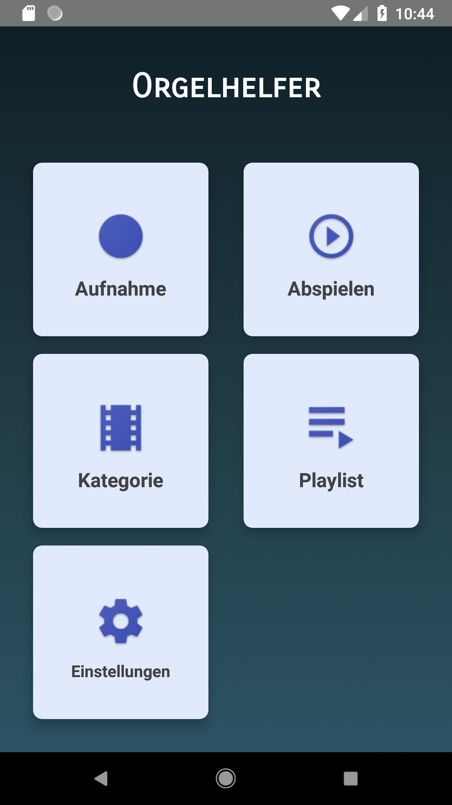
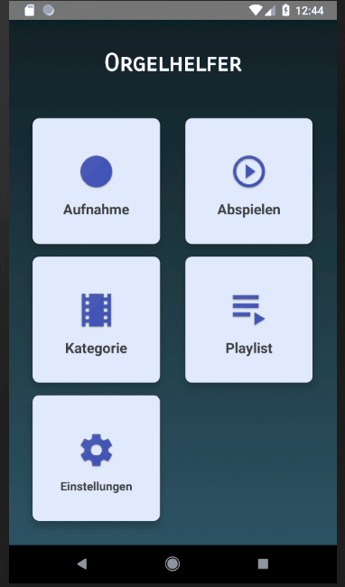
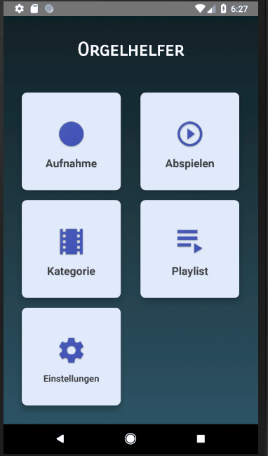
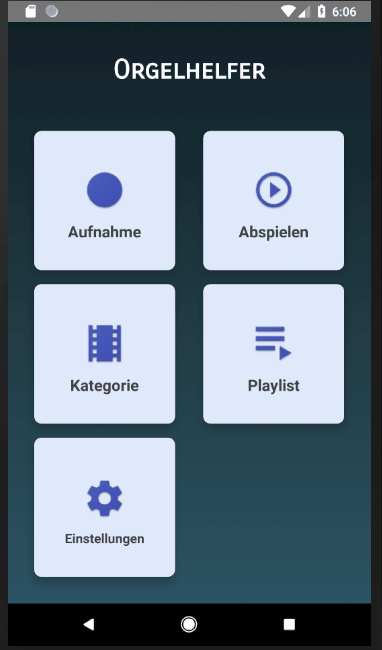
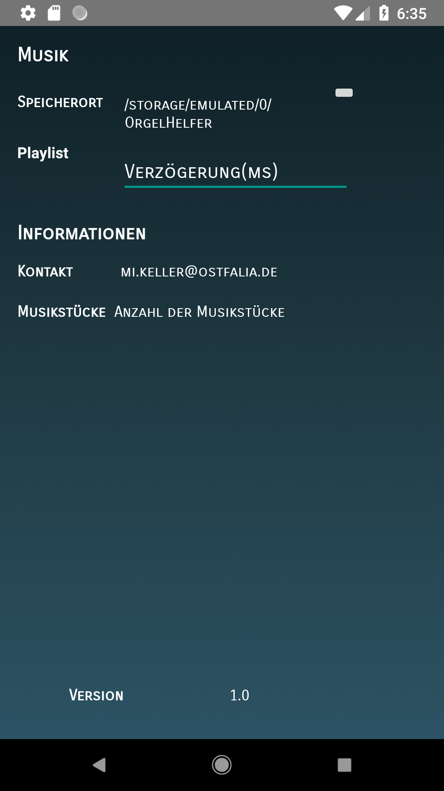

# Orgelhelfer
Der Orgelhelfer ist ein Projekt für das Fach "Anwendungen für Mobile Systeme" an der Ostfalia Hochschule für angewandte Wissenschaften 
im Bereich Informatik. Die App sollte für die St. Katharinen Kirche in Braunschweig entwickelt werden um den Organisten beim Spielen der Orgel zu entlasten.
Die App soll dem Organisten helfen die Register während des Spielen an der Orgel zu ändern. Dies soll über eine Midi-Schnittstelle realisiert werden
Die Orgel ist elektronisch aufgebaut und verfügt über eine SPS-Schnittstelle, die über ein Controller angesprochen wird.

Während der Projektphase wurde das Programm auf einem E-Keyboard umgesetzt. Dort ist relativ schnell deutlich geworden, dass das Umschalten  der Register auf einem Keyboard nicht funktioniert, wie es beschrieben worden ist. Gleichzeitig wurde beim Testen an der Orgel festgestellt, dass das Protokoll für die SPS-Steuerung neu wäre und die Einarbeitungszeit den Projektrahmen sprengen würde.
Aus diesen Gründen wurden die Anforderungen an das Projekt geändert. Die neuen Anforderungen besagen, dass eine Art Spotify für Midi Songs 
entwickelt werden würde, mit dem Unterschied, dass es eine Funktion zum automatischen Weiterspielen eingefügt werden soll. Dies wird
über den Timewarp Algorithmus realisiert. 

## Funktionen des Programms
* Abspielen/Aufnehmen von Midi-Songs
* Speichern der Daten in Playlisten und Kategorien
* Speichern der Daten in einer Room Datenbank
* Automatisches Weiterspielen von Songs
* Dynamic Timewarp Algortithmus für das Weiterspielen

## Referenzen/Frameworks/Libarys
* [RecyclerView](https://github.com/h6ah4i/android-advancedrecyclerview) - Kategorie/Playlist Layout
* [Room Database](https://developer.android.com/topic/libraries/architecture/room) - Datenbank für Kategorien/Playlisten/Tracks

## Bedienung der App
Die App wurde bewusst simpel aufgebaut, da der Organist im fortgeschrittenen Alter ist. 

### Main Activity

Die Main Activity ist nur zum Weiterleiten auf die jeweiligen Menüpunkte gedacht.

### Abspielen Activity(Connect Activity)

In der Abspiel Activity werden die einzelnen Songs aufgenommen und einer Kategorie zugeordnet. Unter den drei Buttons werden die jeweiligen Noten angezeigt, die beim Spielen auf dem Keyboard übertragen werden. Um einen einzelnen Song abzuspielen, wird über "Load Song" der Song geladen und über "Play" dann abgespielt.(Der Algorithmus greift hier nicht)

### Playlist Activty

Die Playlist Activity wurde konzipiert um dem Organisten die Möglichkeit zu geben im Vorraus seine Musikauswahl zu sortieren und diese nacheinander abspielen zu lassen. Tracks können im Prototypen nur einer Playlist hinzugefügt werden. Dies wird über einen Fremdschlüssel in der Klasse "Track" realisiert.

### Kategorie Activity

Die Kategorie Activty funktioniert vom Prinzip her genauso wie die Playlist Activity.Es können einzelne Kategorien angelegt werden und diese können bei der Erstellung von Songs zugewiesen werden. Auch hier gilt, ein Track kann zurzeit einer Kategorie hinzugefügt werden. Die Kategorie wird auch über einen Fremdschlüssel gesetzt.

### Setup Activity

Die Setup Activity war dazu gedacht um dem Nutzer die Möglichkeit zu geben die App zu personalisieren. In der jetzigen Version kann der Pfad zum Speichern der einzelnen Tracks bestimmt werden.

